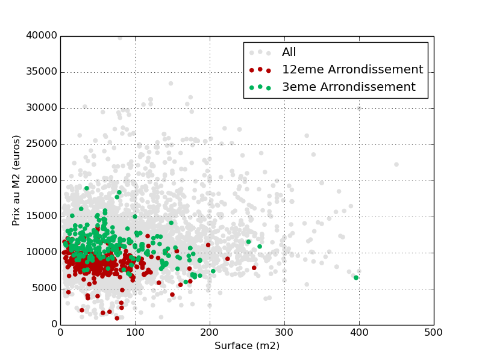
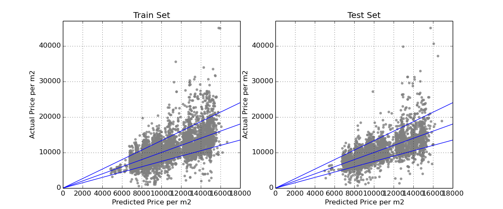
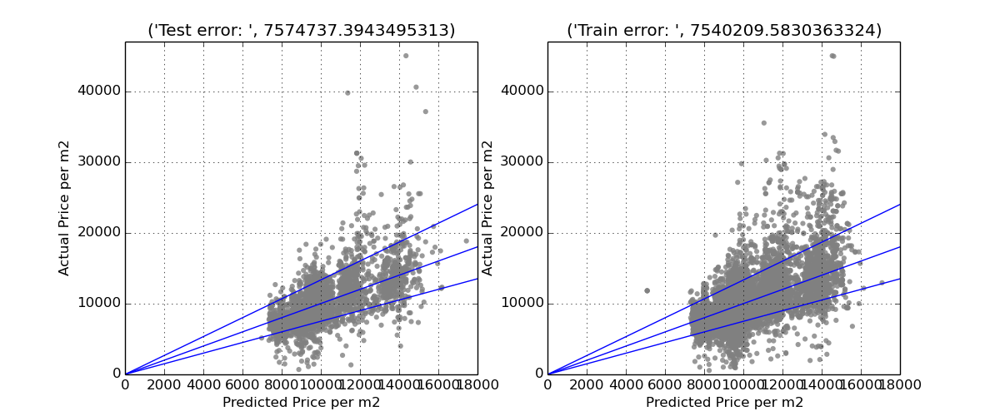

# :house: housebot
Work In Progress ...

Personal project to study Paris housing market.

## Installation

How to install required packages:

```
$ pip install -r requirements.txt
```
(Best is to do it in a virtual env.)

## Crawl

Run scrapy from project root directory:

```
$ scrapy crawl seloger
```

Data will be stored in `data/raw_data.db`

## Settings

Crawler settings are in `housebot/settings.py`.

* `DATABASE` is the sqlite database location. Default is `'./data/raw_data.db'`
* `TIME_SCALE` is the time before which the crawler will not update data info
  (price) for already seen article.
* `ARRONDISSEMENTS` is the list of Paris arrondissement to scrape data from.
* `N_LIST` is the number of result pages the spider will go through for each
  arrondissement
* `SHUFFLE_URLS`: if set to `True`, the spider will crawl randomly result
  pages.
* `DOWNLOADER_MIDDLEWARES`: this dict is a scrapy config to enable Proxies and
  User Agent rotation.
* `CONCURRENT_REQUESTS`: Comment out if using proxies.
* `DOWNLOAD_DELAY`: Used to throttle crawl
* `CONCURRENT_ITEMS`: 1 as we want only one pipeline to avoid concurrency on
  sqlite db.
* `RETRY_TIMES` and `RETRY_HTTP_CODES`: Proxies are throwing lot of errors
  around..
* `PROXY_LIST`: the location of the list.txt containing proxy addresses.

## Results

In progress ...

Here is a general view of the price distribution:



### Linear Model

Fitted a first simple linear model with a small subset of features:
* Area
* number of rooms
* Arrondissement
* Floor Number
* Total building floors

The model is built with Sklearn Library.
* model: `models/linear_model.py`

The model errors are roughly within 25% range... Better than nothing !



The blocks that appear are due to the `arrondissement` features.

When we add more features into the model, the blocks tend to disappear.


